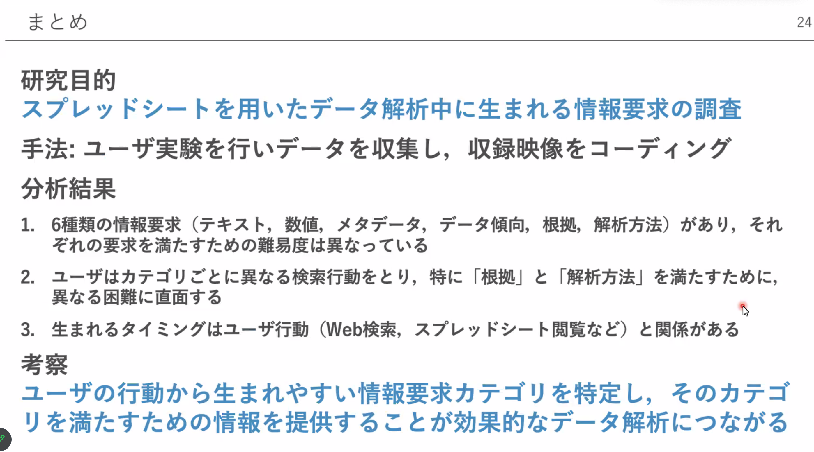
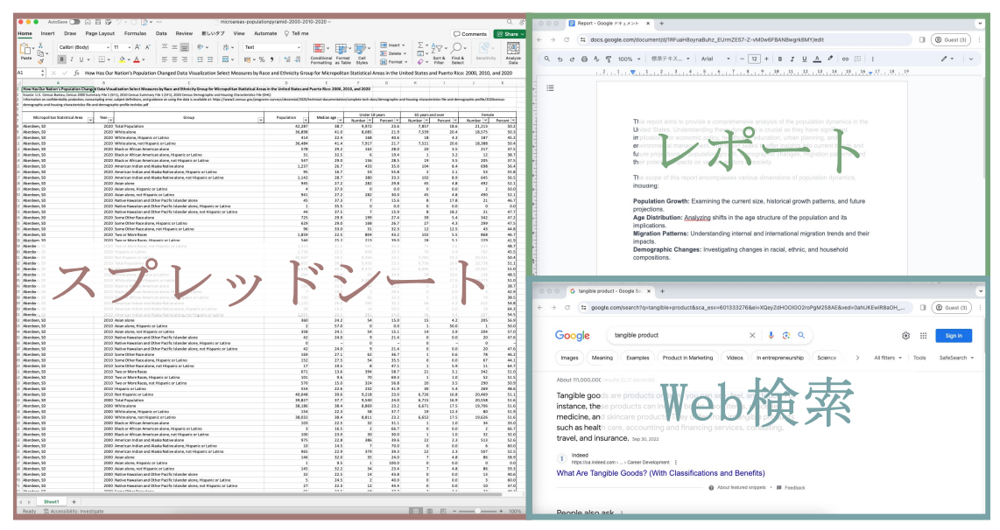
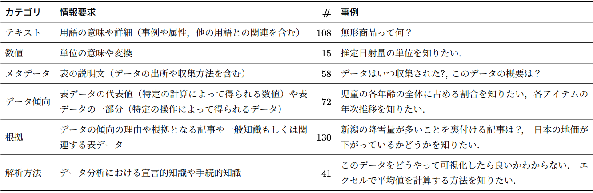
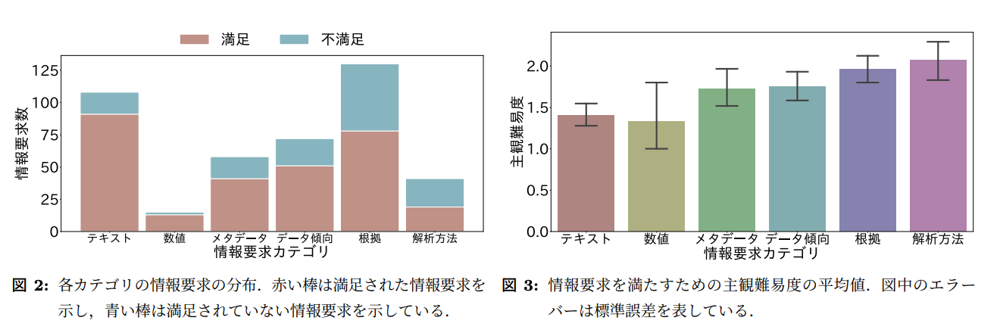
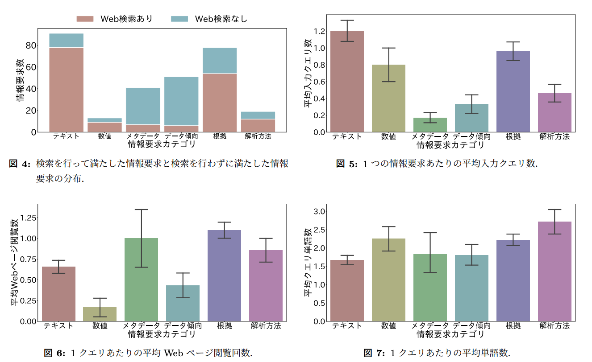
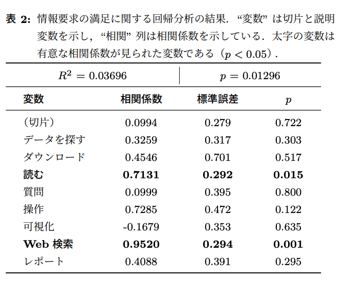
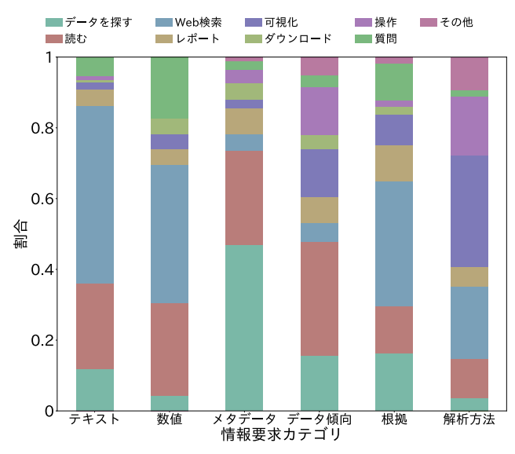
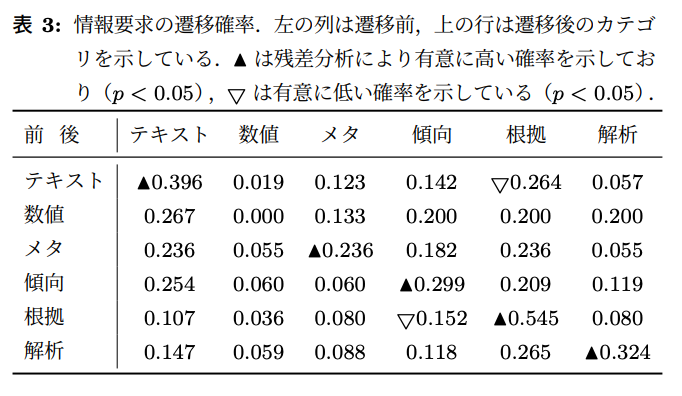

<FirstSlide title="スプレッドシートを用いたデータ解析における情報要求分析" subtitle="筑波大学: 丸田 敦貴, 田貝 奈央, 加藤 誠" belong="214041 中村拓実" />

---

# 原論文

<https://confit.atlas.jp/guide/event-img/deim2024/T3-B-3-03/public/pdf?type=in>

  

---

# 気になった理由

情報要求に対して人はどのようなアクションを取るのか？という問題に対する研究

例えば、この情報要求については検索をする。ということがわかれば、 
**どのようなWebサイトに需要があるのか、またWebサイトはどのような情報を提供すべきかがわかる**

→ 自分の仕事領域と関連する研究

---

# はじめに結論

  

出典: Zoom発表資料

---

# 研究目的

## スプレッドシートを用いたデータ解析における情報要求分析を行う

- データ駆動の意思決定は重要
- スプシは直感的なデータ操作が可能なツール
- スプシはデータ解析の知識不足を一部補うことが可能,一方スプレッドシート自体の理解や分析結果の正確な解釈のために，多様な知識（ドメイン知識や分析方法の知識など）が必要
- ↑ユーザはスプレッドシート理解のために約 40%の時間を情報探索に費やしている(先行研究)
- 直感的なデータ分析のためには、**ユーザの情報要求を理解することが重要**

---

# リサーチクエスチョン(RQ)

<v-clicks class="grid grid-rows-3 text-lg">

1. スプレッドシートを用いたデータ解析中にどのような情報要求が生まれるのか？

2. スプレッドシートを用いたデータ解析中の情報要求を満たすためにユーザはどのように検索するのか？

3. スプレッドシートを用いたデータ解析において，いつ情報要求が生まれるのか？

</v-clicks>

<v-click >

 要するに、**いつ なにを どうやって** 検索するのか？

 

</v-click>

---

# 実験方法

- 対象: 36人の大学院生
- タスク: スプレッドシートを使用してデータを分析し、その結果をまとめたレポートを作成
- 条件: 参加者は、データ解析プロセス中に生じる情報要求を探求するため、**思考発話法**を用いて自身の考えを声に出して述べる
- 分類手法: 初期の情報要求の分類法は文献調査に基づいて作成され、収集した情報要求の実例を用いて改善
- 評価: タスク終了後のインタビューを通じて、各情報要求に対する主観的な満足度と検索の難易度についてのデータを収集

---

  

---

# RQ1: スプレッドシートを用いたデータ解析中にどのような情報要求が生まれるのか？

データ解析の情報行動の分類法やシステムに関する 85 本の論文を収集し，先行研究から 5 つのカテゴリからなる仮の分類法を構築した

| カテゴリ | 概要 |
| --- | --- |
| テキスト | 表中の単語の意味に関する要求 |
| データ | 閲覧している表に含まれていない表に関する要求 |
| メタデータ | 表の出典元や作成方法などの表自体の情報に関する要求 |
| 知見 | 知見の根拠となる文献およびデータに関する要求 |
| 分析方法 | データ解析の方法に関する要求 |

---

# 分類の改善

仮の分類法でインタビューを実施

2人の著者がそれぞれ独立してインタビューの記録を分類し、新たな分類法を構築

新たな分類法をお互いに見せあい、議論を行い、最終的な分類法を構築

→ 5つのカテゴリから 6つのカテゴリに変更

  

---

# カテゴリ別の主観難易度

  

`根拠`や`解析方法`のカテゴリが難易度が高い

---

# RQ2: スプレッドシートを用いたデータ解析中の情報要求を満たすためにユーザはどのように検索するのか？

Web検索の利用に優位な差が見られた

  

---

# 分析

- `テキスト` と `根拠` カテゴリ → Web 検索 多
- `メタデータ` と `データ傾向` カテゴリ → Web 検索 少

`テキスト` と `根拠` カテゴリを満たすための情報が Web 上に多い

反対に，`メタデータ`と `データ傾向` カテゴリを満たすための情報がスプレッドシートに含まれることが多い

---

# ユーザー行動と情報要求の満足度を明らかにする

ユーザ行動と情報要求の満足との相関の程度を明らかにするために，ロジスティック回帰分析を実施

- 目的変数: ユーザの満足を示すバイナリ変数
- 説明変数: 情報要求が生まれたセグメントで，どのユーザ行動が見られたかを示すバイナリ変数

**Web検索とスプシを読むときに情報要求が生まれると，ユーザの満足度が高い**

  

---

# RQ3: スプレッドシートを用いたデータ解析において，いつ情報要求が生まれるのか？

  

**情報要求に対するユーザー行動は異なる傾向**

---

# 情報要求と遷移確率

  

**同じカテゴリの情報要求は続けて発生しやすい**

→ まとめて情報を探す。(e.g: スプシの使い方を調べる→データ分析の方法を調べる などは少ない)

---

# 結論(再掲)

  

出典: Zoom発表資料

---

# 感想

- 情報要求に対して、Web検索という行動は多く発生する
- 逆に、Web検索で満たされない情報要求はスプレッドシートに含まれることが多い(メタデータ)
- 複雑な情報がほしいときはクエリが長くなる → 生成系AIが適切なクエリに表現し直したりしたら面白そう
- Web検索が多いけど、実際に情報要求ごとの滞在時間やサイトの特徴を調べてみたい
- 先行研究の内容で面白そうなのがいくつかあった
  - ユーザの行動に基づいて検索効果を向上させる研究
  - 複雑な検索タスクにおけるユーザの行動を調査した研究
- この研究のスコープをWeb検索に絞り、具体的なサイトの特徴を調査する研究も面白そう

---
