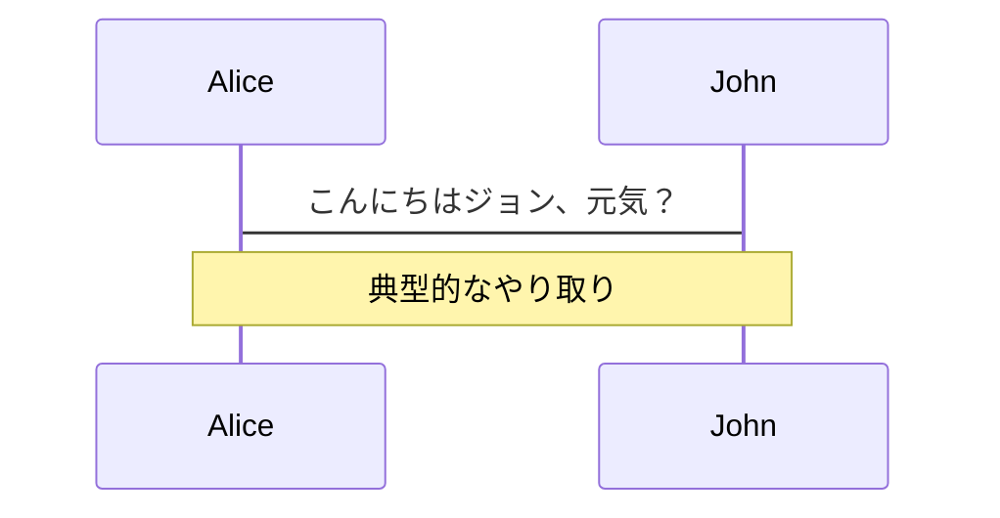
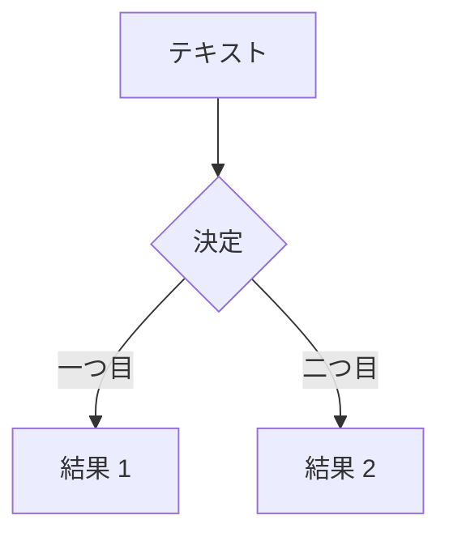
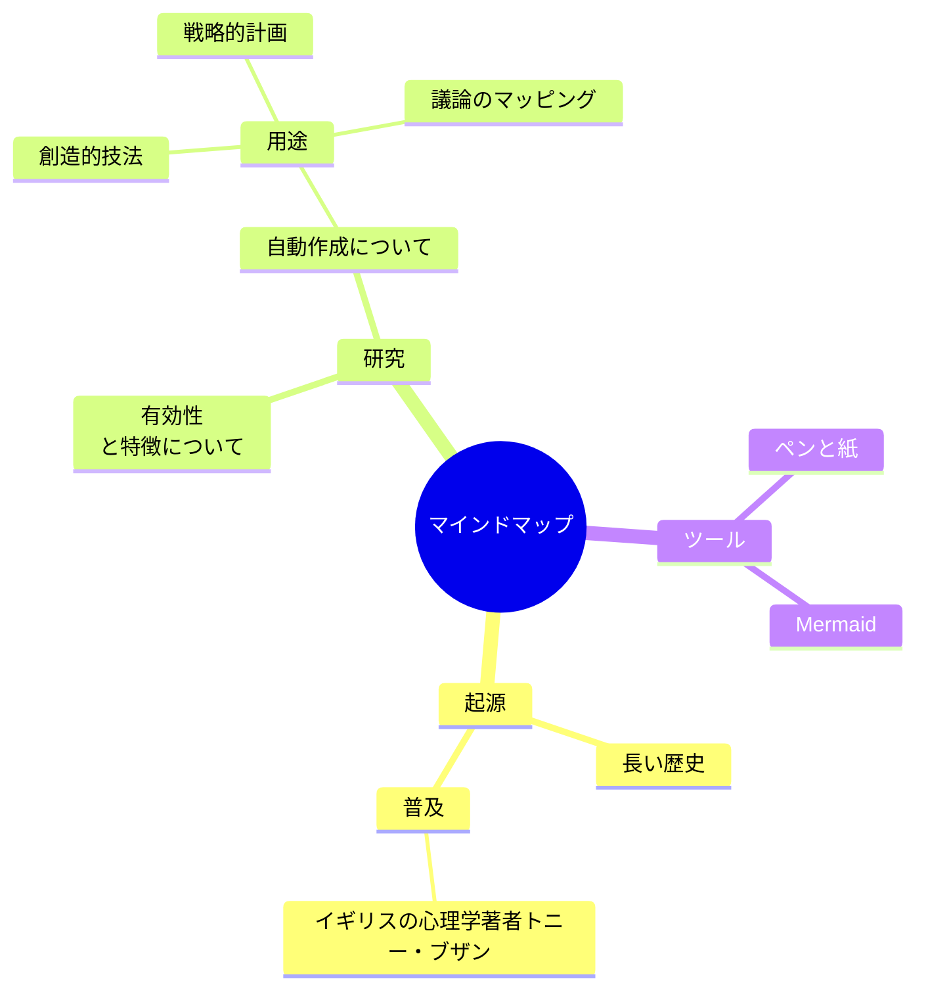
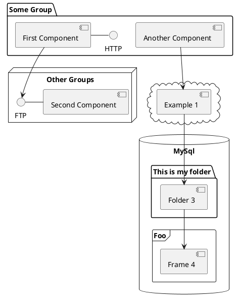

# Slidevへようこそ

開発者のためのプレゼンテーションスライド

<div @click="$slidev.nav.next" class="mt-12 py-1" hover:bg="white op-10">
  次のページへはスペースキーを押してください <carbon:arrow-right />
</div>

<div class="abs-br m-6 text-xl">
  <button @click="$slidev.nav.openInEditor()" title="エディタで開く" class="slidev-icon-btn">
    <carbon:edit />
  </button>
  <a href="https://github.com/slidevjs/slidev" target="_blank" class="slidev-icon-btn">
    <carbon:logo-github />
  </a>
</div>

<!--
各スライドの最後のコメントブロックはスライドノートとして扱われます。プレゼンターモードでスライドと一緒に表示および編集が可能です。[ドキュメントでもっと読む](https://sli.dev/guide/syntax.html#notes)
-->

---
transition: fade-out
---

# Slidevとは？

Slidevは開発者向けに設計されたスライド作成・プレゼンテーションツールで、以下の特徴があります

- 📝 **テキストベース** - Markdownでコンテンツに集中し、後からスタイリング
- 🎨 **テーマ対応** - テーマはnpmパッケージとして共有・再利用可能
- 🧑‍💻 **開発者フレンドリー** - コードのハイライト、オートコンプリート付きのライブコーディング
- 🤹 **インタラクティブ** - Vueコンポーネントを埋め込んで表現力を強化
- 🎥 **レコーディング** - 組み込みの録画機能とカメラビュー
- 📤 **ポータブル** - PDF、PPTX、PNG、ホスト可能なSPAへのエクスポート
- 🛠 **カスタマイズ可能** - Webページで可能なことはSlidevでも実現可能
<br>

<br>

詳細は[Slidevの特徴](https://sli.dev/guide/why)をご覧ください

<!--
マークダウン内で`style`タグを使用して現在のページのスタイルを上書きできます。
詳細: https://sli.dev/features/slide-scope-style
-->

<style>
h1 {
  background-color: #2B90B6;
  background-image: linear-gradient(45deg, #4EC5D4 10%, #146b8c 20%);
  background-size: 100%;
  -webkit-background-clip: text;
  -moz-background-clip: text;
  -webkit-text-fill-color: transparent;
  -moz-text-fill-color: transparent;
}
</style>

<!--
こちらは別のコメントです。
-->

---
transition: slide-up
level: 2
---

# ナビゲーション

左下隅にカーソルを合わせるとナビゲーションコントロールパネルが表示されます。[詳細はこちら](https://sli.dev/guide/ui#navigation-bar)

## キーボードショートカット

|                                                     |                                  |
| --------------------------------------------------- | -------------------------------- |
| <KBD>right</KBD> / <KBD>space</KBD>                 | 次のアニメーションまたはスライド |
| <KBD>left</KBD>  / <KBD>shift</KBD><KBD>space</KBD> | 前のアニメーションまたはスライド |
| <KBD>up</KBD>                                       | 前のスライド                     |
| <KBD>down</KBD>                                     | 次のスライド                     |

<!-- https://sli.dev/guide/animations.html#click-animation -->

<p v-after class="absolute bottom-23 left-45 opacity-30 transform -rotate-10">ここ！</p>

---
layout: two-cols
layoutClass: gap-16
---

# 目次

スライドの目次を生成するには、`Toc`コンポーネントを使用できます：

```html
<Toc minDepth="1" maxDepth="1" />
```

タイトルはスライドの内容から自動的に取得されますが、frontmatterで`title`と`level`を指定することで上書きできます。

::right::

<Toc text-sm minDepth="1" maxDepth="2" />

---
layout: image-right
image: <https://cover.sli.dev>
---

# コード

コードスニペットを使用すると、ハイライトや型情報のホバー表示が直接得られます！

```ts {all|5|7|7-8|10|all} twoslash
// TwoSlashはTypeScriptのホバー情報を有効化します
// マークダウンコードブロック内のエラーも表示されます
// 詳細は https://shiki.style/packages/twoslash

import { computed, ref } from 'vue'

const count = ref(0)
const doubled = computed(() => count.value * 2)

doubled.value = 2
```

<arrow v-click="[4, 5]" x1="350" y1="310" x2="195" y2="334" color="#953" width="2" arrowSize="1" />

<!-- これで外部コードブロックを埋め込むことができます -->
<<< @/snippets/external.ts#snippet

<!-- フッター -->

[詳細はこちら](https://sli.dev/features/line-highlighting)

<!-- インラインスタイル -->
<style>
.footnotes-sep {
  @apply mt-5 opacity-10;
}
.footnotes {
  @apply text-sm opacity-75;
}
.footnote-backref {
  display: none;
}
</style>

<!--
ノートはクリックと同期することもできます

[click] これは最初のクリック後にハイライトされます

[click] `count = ref(0)`でハイライト

[click:3] 最後のクリック（2回のクリックをスキップ）
-->

---
level: 2
---

# Shiki Magic Move

[shiki-magic-move](https://shiki-magic-move.netlify.app/)を活用し、Slidevは複数のコードスニペット間のアニメーションをサポートします。

複数のコードブロックを追加し、それらを<code>````md magic-move</code>（4つのバッククォート）で囲むことでマジックムーブを有効にできます。例えば：

````md magic-move {lines: true}
```ts {*|2|*}
// ステップ 1
const author = reactive({
  name: 'John Doe',
  books: [
    'Vue 2 - Advanced Guide',
    'Vue 3 - Basic Guide',
    'Vue 4 - The Mystery'
  ]
})
```

```ts {*|1-2|3-4|3-4,8}
// ステップ 2
export default {
  data() {
    return {
      author: {
        name: 'John Doe',
        books: [
          'Vue 2 - Advanced Guide',
          'Vue 3 - Basic Guide',
          'Vue 4 - The Mystery'
        ]
      }
    }
  }
}
```

```ts
// ステップ 3
export default {
  data: () => ({
    author: {
      name: 'John Doe',
      books: [
        'Vue 2 - Advanced Guide',
        'Vue 3 - Basic Guide',
        'Vue 4 - The Mystery'
      ]
    }
  })
}
```

コード以外のブロックは無視されます。

```vue
<!-- ステップ 4 -->
<script setup>
const author = {
  name: 'John Doe',
  books: [
    'Vue 2 - Advanced Guide',
    'Vue 3 - Basic Guide',
    'Vue 4 - The Mystery'
  ]
}
</script>
```
````

---

# コンポーネント

<div grid="~ cols-2 gap-4">
<div>

スライド内で直接Vueコンポーネントを使用できます。

`<Tweet/>` や `<Youtube/>` などの組み込みコンポーネントが提供されており、直接使用できます。また、カスタムコンポーネントの追加も非常に簡単です。

```html
<Counter :count="10" />
```

<!-- ./components/Counter.vue -->
<Counter :count="10" m="t-4" />

詳細は[ガイド](https://sli.dev/builtin/components.html)をご覧ください。

</div>
<div>

```html
<Tweet id="1390115482657726468" />
```

<Tweet id="1390115482657726468" scale="0.65" />

</div>
</div>

<!--
プレゼンターノートには **太字**、*斜体*、そして ~~取り消し線~~ テキストが使えます。

また、HTML要素も有効です：
<div class="flex w-full">
  <span style="flex-grow: 1;">左側のコンテンツ</span>
  <span>右側のコンテンツ</span>
</div>
-->

---
class: px-20
---

# テーマ

Slidevには強力なテーマサポートがあります。テーマはスタイル、レイアウト、コンポーネント、さらにはツールの設定まで提供できます。frontmatterで**たった一箇所の編集**でテーマを切り替えられます：

<div grid="~ cols-2 gap-2" m="t-2">

```yaml
---
theme: default
---
```

```yaml
---
theme: seriph
---
```


</div>

[テーマの使い方](https://sli.dev/guide/theme-addon#use-theme)や
[素晴らしいテーマギャラリー](https://sli.dev/resources/theme-gallery)についてもっと読む。

---

# クリックアニメーション

要素に`v-click`を追加することでクリックアニメーションを追加できます。

<div v-click>

これはスライドをクリックすると表示されます：

```html
<div v-click>これはスライドをクリックすると表示されます。</div>
```

</div>

<br>

<v-click>

<span v-mark.red="3"><code>v-mark</code> ディレクティブ</span>
を使用すると
<span v-mark.circle.orange="4">インラインマーク</span>
を追加できます。[Rough Notation](https://roughnotation.com/)を活用しています：

```html
<span v-mark.underline.orange>インラインマーカー</span>
```

</v-click>

<div mt-20 v-click>

[詳細はこちら](https://sli.dev/guide/animations#click-animation)

</div>

---

# モーション

モーションアニメーションは[@vueuse/motion](https://motion.vueuse.org/)によって提供され、`v-motion`ディレクティブによってトリガーされます。

```html
<div
  v-motion
  :initial="{ x: -80 }"
  :enter="{ x: 0 }"
  :click-3="{ x: 80 }"
  :leave="{ x: 1000 }"
>
  Slidev
</div>
```

<div class="w-60 relative">
  <div class="relative w-40 h-40">
    
    
    
  </div>

  <div
    class="text-5xl absolute top-14 left-40 text-[#2B90B6] -z-1"
    v-motion
    :initial="{ x: -80, opacity: 0}"
    :enter="{ x: 0, opacity: 1, transition: { delay: 2000, duration: 1000 } }">
    Slidev
  </div>
</div>

<!-- vueのscript setupスクリプトはマークダウン内で直接使用でき、現在のページにのみ影響します -->
<script setup lang="ts">
const final = {
  x: 0,
  y: 0,
  rotate: 0,
  scale: 1,
  transition: {
    type: 'spring',
    damping: 10,
    stiffness: 20,
    mass: 2
  }
}
</script>

<div
  v-motion
  :initial="{ x:35, y: 30, opacity: 0}"
  :enter="{ y: 0, opacity: 1, transition: { delay: 3500 } }">

[詳細はこちら](https://sli.dev/guide/animations.html#motion)

</div>

---

# LaTeX

LaTeXはすぐに使用できます。[KaTeX](https://katex.org/)によって提供されています。

<div h-3 />

インライン $\sqrt{3x-1}+(1+x)^2$

ブロック
$$ {1|3|all}
\begin{aligned}
\nabla \cdot \vec{E} &= \frac{\rho}{\varepsilon_0} \\
\nabla \cdot \vec{B} &= 0 \\
\nabla \times \vec{E} &= -\frac{\partial\vec{B}}{\partial t} \\
\nabla \times \vec{B} &= \mu_0\vec{J} + \mu_0\varepsilon_0\frac{\partial\vec{E}}{\partial t}
\end{aligned}
$$

[詳細はこちら](https://sli.dev/features/latex)

---

# ダイアグラム

テキストによる記述から直接マークダウン内でダイアグラムやグラフを作成できます。

<div class="grid grid-cols-4 gap-5 pt-4 -mb-6">


```mermaid {scale: 0.5, alt: 'シンプルなシーケンス図'}
sequenceDiagram
    Alice->John: こんにちはジョン、元気？
    Note over Alice,John: 典型的なやり取り
```


```mermaid {theme: 'neutral', scale: 0.8}
graph TD
B[テキスト] --> C{決定}
C -->|一つ目| D[結果 1]
C -->|二つ目| E[結果 2]
```


```mermaid
mindmap
  root((マインドマップ))
    起源
      長い歴史
      ::icon(fa fa-book)
      普及
        イギリスの心理学著者トニー・ブザン
    研究
      有効性<br/>と特徴について
      自動作成について
        用途
            創造的技法
            戦略的計画
            議論のマッピング
    ツール
      ペンと紙
      Mermaid
```


```plantuml {scale: 0.7}
@startuml

package "Some Group" {
  HTTP - [First Component]
  [Another Component]
}

node "Other Groups" {
  FTP - [Second Component]
  [First Component] --> FTP
}

cloud {
  [Example 1]
}

database "MySql" {
  folder "This is my folder" {
    [Folder 3]
  }
  frame "Foo" {
    [Frame 4]
  }
}

[Another Component] --> [Example 1]
[Example 1] --> [Folder 3]
[Folder 3] --> [Frame 4]

@enduml
```

</div>

詳細: [Mermaidダイアグラム](https://sli.dev/features/mermaid) と [PlantUMLダイアグラム](https://sli.dev/features/plantuml)

---
foo: bar
dragPos:
  square: 691,32,167,_,-16
---

# ドラッグ可能な要素

ドラッグ可能な要素をダブルクリックすると位置を編集できます。

<br>

###### ディレクティブの使用法

```md

```

<br>

###### コンポーネントの使用法

```md
<v-drag text-3xl>
  <div class="i-carbon:arrow-up" />
  ドラッグ可能なコンテナを作るには `v-drag` コンポーネントを使用します！
</v-drag>
```

<v-drag pos="663,206,261,_,-15">
  <div text-center text-3xl border border-main rounded>
    ダブルクリックしてね！
  </div>
</v-drag>


###### ドラッグ可能な矢印

```md
<v-drag-arrow two-way />
```

<v-drag-arrow pos="67,452,253,46" two-way op70 />

---
src: ./pages/imported-slides.md
hide: false
---

---

# Monaco エディタ

Slidevは組み込みのMonaco Editorをサポートしています。

コードブロックに `{monaco}` を追加するとエディタに変換されます：

```ts {monaco}
import { ref } from 'vue'
import { emptyArray } from './external'

const arr = ref(emptyArray(10))
```

`{monaco-run}` を使用すると、スライド内で直接コードを実行できるエディタが作成されます：

```ts {monaco-run}
import { version } from 'vue'
import { emptyArray, sayHello } from './external'

sayHello()
console.log(`vue ${version}`)
console.log(emptyArray<number>(10).reduce(fib => [...fib, fib.at(-1)! + fib.at(-2)!], [1, 1]))
```

---
layout: center
class: text-center
---

# もっと学ぶ

[ドキュメント](https://sli.dev) · [GitHub](https://github.com/slidevjs/slidev) · [ショーケース](https://sli.dev/resources/showcases)

<PoweredBySlidev mt-10 />
